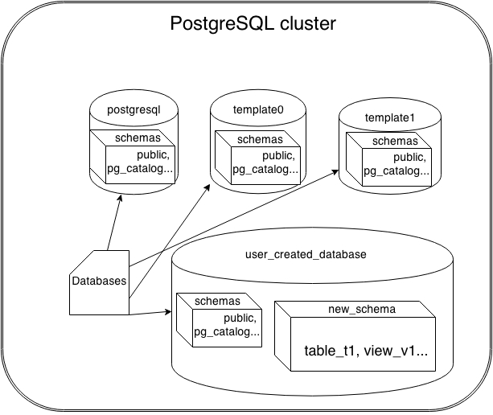

#### Cluster

* In postgres a cluster mean a set of databases using the same configuration files, listening to requests at a common port.
* Cluster uses common file system locations.
* There are common set of background processes and memory structures used by the same cluster.

#### Tablespaces 

* Tablespace is a link to a location in filesystem (usually a directory). It's a container to holding all database objects such as tables, indexes and etc.
* When a cluster is created, there will be two default tablespaces:
`pg_default` where all objects created by users without a tablespace will be created in `pg_default` tablespace.
`pg_global` holds all system tables shared by all databases in the cluster.
* When creating a database object, we can specify its tablespace so that we can have different purpose for each object. (Example: Transaction table to a faster hard drive)
* when we create a table, if no tablespace is specify it wil ltake the default tablespace

User's default tablespace can also be changed as well:
```
test=# ALTER DATABASE test SET default_tablespace='mytablespace';
ALTER DATABASE
test=# CREATE USER myuser;
test=# ALTER USER myuser SET default_tablespace='mytablespace';
ALTER ROLE
```

* During recovery, we also need to make sure all these tablespaces points to the right directory in the replicas.

#### Managing temporary object with temporary tablespaces

* Used for places where the data can be lost, there is no (WAL) where the data is temporal such as complex calculation (Extract, Transform, Load) or web login session.
* In cases where we would redo the whole batch in an event of failure, in these situation performance is usuaslly preferred over durability.
* There are two special type of tables used for these situation: `temporary table` and `unlogged table`

`CREATE TEMPORARY TABLE mytemp (id int);`
* other psql sesion cannot access to this table, this table is created in `session-private` buffer, because there is only a single access a lot of overhead is avoided.
* we can query under which schema the tables are created to check the type of that table

```
SELECT relname,relnamespace,pn.oid, pn.nspname FROM
pg_class pc JOIN  pg_namespace pn ON
pc.relnamespace=pn.oid  where relname IN ('mytemp','emp');
 relname | relnamespace |  oid   |  nspname  
---------+--------------+--------+-----------
 emp     |         2200 |   2200 | public
 mytemp  |       364778 | 364778 | pg_temp_2
 ```
 
 * it is possible to create index to temporary tables, autovacuum daemon does not vacuum or analyze temporary tables, but you perform those action on a temporary table.
 * the table will be dropped once the session ends, `ON COMMIT` allows you to either drop the table at the end of transaction or preserve/delete the data with different options.
 
 
 Temporary table is a subset of unlogged table
 
#### Unlogged table
* allows different session to share the same table, but still willing to compromise on durability.
 Example: 
 ```CREATE  UNLOGGED TABLE myunloggedtbl(id int);```
* Data inserted into this table will be accessible from all sessions. The changes to the table data will survive normal restarts, but might not survive crashes.
 
#### Views
* Views are jsut stored queries, they do not store data.
* When we execute a query against a view, the underlying tables anre queried.
* Views can be used as a security measure to make sure that user can only see a subset of records so we can allow user with different level of accesss.
* View also make it easier to retrieve data or simplify complicated queries.
 
#### Database
* A collection of SQL objects, to access other databases dbliink or foreign data wrapper is used.
 
#### Schema
* Container within a database, any database object (table, index, view, etc) is created under a schema. 
* Schema is used to group related objects within the same database.
* When an object does not have a schema specified, it will be assigned to a default schema called `public`
* Users cannot access any object in schemas they do not own
* To allow users to make use of the objects in other schemas, additional privileges (for example, SELECT and UPDATE on tables) must be granted, as appropriate for the object.

#### search_path
* very similar to PATH environment variable in Unix and Windows OS.
* PostgreSQL uses a setting called `search_path` to figure out where it should search for the object user is trying to access.
* search_p`ath` is the one setting that can be set in different ways (configuration file and command line) at different levels (user, database, and session).
more details in the book chapter 3, `Databases, schemas, and search_path`.

So, the objects in a PostgreSQL cluster can be represented, as shown in the following diagram:


#### Schema use cases
* In a system where users deal with mutually-exclusive data sets, it's possible to create one schema per user and ensure security by providing each user access to his/her schema alone.


#### Roles & Privileges
* Roles is almost the same as user, a role can be a user or a group of users. 
* `CREATE USER` and `CREATE ROLE` are almost the same, the only exception being `CREATE USER` implies LOGIN privilege, where as `CREATE ROLE` does not.
* `ALTER ROLE my_role WITH login;`, this provide login privilege to my_role.
* `postgres` role as it has the superuser attribute, but it does not have to be `postgres`, any user can be superuser.
* `postgres=# \du+` to see all of the database user and their roles.


