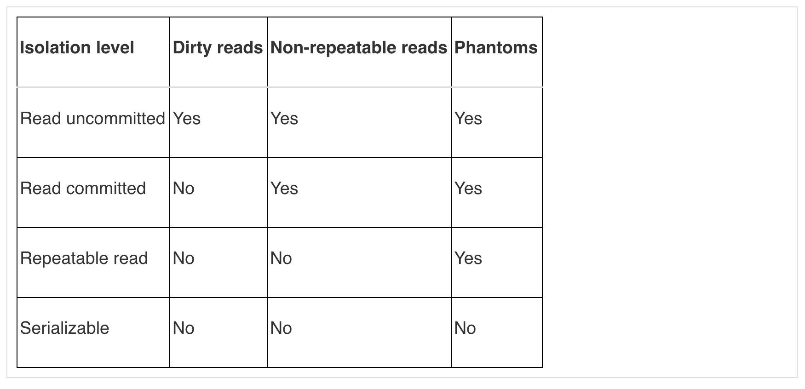

#### Transaction
* transaction is a set or more SQL statements which takes a database from one consistent state to another.

#### ACID

Atomicity - logical unit either all SQL statements get executed or none of them does.
Consistency - transaction will take database from one consistent state (where all defined and enforced buinses rule holds true) to another.
Isolation - no user is impacted by whatever other user is doing at the same time. MVCC (Multiversion Concurrency Control) handles scenarios where there maybe updates/read conflicts.

SQL standard isolation levels:
[postgresql have pretty good documentation of isolation level](https://www.postgresql.org/docs/9.5/transaction-iso.html)
* read uncommitted (dirty read) - uncommited changes made in one session will be available to other session. 
* read committed - can have phantom read, committed transaction will be made available to other sessions, issue with read committed is that there is no lock, so multiple selects could have changed because of another session.
* repeatable reads - repeatable reads would be locked thus wont be modified by other session, this simply imples that the locking level has become stricter.
* serializable - transaction occur as if they are happening serially, one after another, phantom read is not possible

* In postgres there can only be three levels of isolation (read committed, repeatable reads, serializable)

#### Read committed
* default isolation level, a query sees a snapshot of data that were committed before the statement executes.
* each statement is a transaction if we do not explicit state that it is a series of transaction by using (BEGIN, COMMIT, ROLLBACK)
* in postgres we use begin, end, commit and rollback to wrap a set of statements into a transaction

#### Repeatable read
* in this level, the result will always be consistent. snapshot as it existed at the time of execution time.
* this becomes read only (exclusive lock)
* read more on chapter 4, postgresql and MVCC on this

#### Serializable level
* strictest level available, it keeps locks that allow when a write would have impact on previous read from a concurrent transaction, had it run first (run write first before read).
* does not cause deadlock because there is no blocking, it will at serializable isolation level detect any conflicts, and abort any anomalies.
* up to developer to decide if a transaction should be retried when a rollback is detected.
* read more on chapter 4, postgresql and MVCC on this

=> Serializable or repeatable read transactions use one snapshot for the entire transaction
=> read committed transaction uses a new snapshot for each statement.
